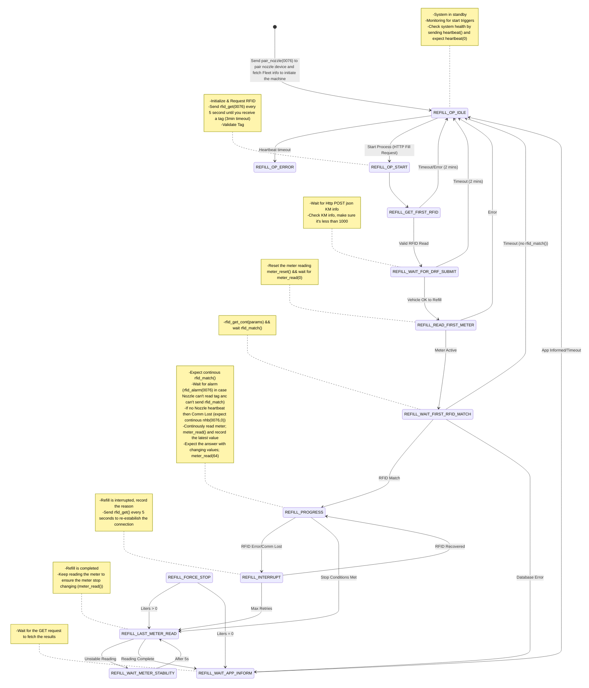

```mermaid
stateDiagram-v2

    [*] --> REFILL_OP_IDLE : Send pair_nozzle(0076) to pair nozzle device and fetch Fleet info to initiate the machine 
    note left of REFILL_OP_IDLE
        -System in standby
        -Monitoring for start triggers
        -Check system health by sending heartbeat() and expect heartbeat(0) 
    end note

    REFILL_OP_IDLE --> REFILL_OP_ERROR: Heartbeat timeout
    
    REFILL_OP_IDLE --> REFILL_OP_START: Start Process (HTTP Fill Request)
    note left of REFILL_OP_START
        -Initialize & Request RFID
        -Send rfid_get(0076) every 5 second until you receive a tag (3min timeout)
        -Validate Tag
    end note
    
    REFILL_OP_START --> REFILL_GET_FIRST_RFID: 
    
    REFILL_GET_FIRST_RFID --> REFILL_OP_IDLE: Timeout/Error (2 mins)
    REFILL_GET_FIRST_RFID --> REFILL_WAIT_FOR_DRF_SUBMIT: Valid RFID Read
    note left of REFILL_WAIT_FOR_DRF_SUBMIT
        -Wait for Http POST json KM info
        -Check KM info, make sure it's less than 1000
    end note
    
    REFILL_WAIT_FOR_DRF_SUBMIT --> REFILL_OP_IDLE: Timeout (2 mins)
    REFILL_WAIT_FOR_DRF_SUBMIT --> REFILL_READ_FIRST_METER: Vehicle OK to Refill
    note left of REFILL_READ_FIRST_METER
        -Reset the meter reading meter_reset() && wait for meter_read(0)
    end note
    
    REFILL_READ_FIRST_METER --> REFILL_OP_IDLE: Error
    REFILL_READ_FIRST_METER --> REFILL_WAIT_FIRST_RFID_MATCH: Meter Active
    note left of REFILL_WAIT_FIRST_RFID_MATCH
        -rfid_get_cont(params) && wait rfid_match()
    end note


    REFILL_WAIT_FIRST_RFID_MATCH --> REFILL_OP_IDLE: Timeout (no rfid_match())
    REFILL_WAIT_FIRST_RFID_MATCH --> REFILL_PROGRESS: RFID Match
    note left of REFILL_PROGRESS
        -Expect continous rfid_match()
        -Wait for alarm (rfid_alarm(0076) in case Nozzle can't read tag anc can't send rfid_match)
        -If no Nozzle heartbeat then Comm Lost (expect continous nhb(0076,0))
        -Continously read meter; meter_read() and record the latest value
        -Expect the answer with changing values; meter_read(64)
    end note
    REFILL_WAIT_FIRST_RFID_MATCH --> REFILL_WAIT_APP_INFORM: Database Error
    
    REFILL_PROGRESS --> REFILL_INTERRUPT: RFID Error/Comm Lost
    note left of REFILL_INTERRUPT
        -Refill is interrupted, record the reason
        -Send rfid_get() every 5 seconds to re-estabilish the connection
    end note
    
    REFILL_INTERRUPT --> REFILL_PROGRESS: RFID Recovered
    
    REFILL_PROGRESS --> REFILL_LAST_METER_READ: Stop Conditions Met
    REFILL_INTERRUPT --> REFILL_LAST_METER_READ: Max Retries
    
    note left of REFILL_LAST_METER_READ
        -Refill is completed
        -Keep reading the meter to ensure the meter stop changing (meter_read())
    end note
    
    REFILL_LAST_METER_READ --> REFILL_WAIT_METER_STABILITY: Unstable Reading
    REFILL_LAST_METER_READ --> REFILL_WAIT_APP_INFORM: Reading Complete
    
    REFILL_WAIT_METER_STABILITY --> REFILL_LAST_METER_READ: After 5s
    
    REFILL_WAIT_APP_INFORM --> REFILL_OP_IDLE: App Informed/Timeout
    note left of REFILL_WAIT_APP_INFORM
        -Wait for the GET request to fetch the results
    end note
    
    REFILL_FORCE_STOP --> REFILL_LAST_METER_READ: Liters > 0
    REFILL_FORCE_STOP --> REFILL_WAIT_APP_INFORM: Liters = 0
```
